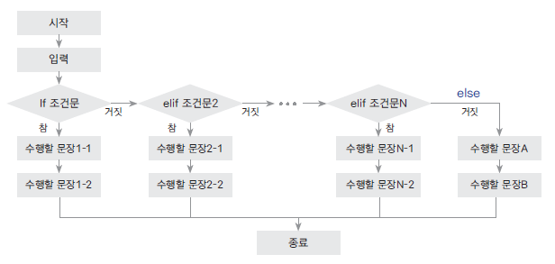

# 실습
## 제어문
- 제어문은 if 문, while 문, for 문으로 나뉜다. 
- for 문은 while 문의 확장이라고 생각할 수 있다.

### if 문
- "버스 막차 시간이 지나지 않았으면 버스를 타고, 막차 시간이 지났으면 택시를 탄다" 를 프로그래밍으로 표현할 수 있다.
```python
# current_time, last_bus_arrival_time이라는 변수와 take_bus, take_taxi라는 함수가 정의되지 않았으므로 실행은 되지 않는다.
if current_time < last_bus_arrival_time:
    print('버스를 탔습니다')
else:
    print('택시를 탔습니다')

print('집에 도착했습니다')
```

- if 문은 아래와 같이 구성된다.
    - 조건문에는 1장에서 보았던 bool 형 자료형으로 나타낼 수 있는 연산자나 변수(또는 함수)가 들어갈 수 있다.
        - 조건문 뒤에는 꼭 콜론 `:` 이 붙어야 한다.
    - 실행문1은 조건문이 True 참일때만 실행된다.
    - 들여쓰기가 되어 있다면 몇 줄이든 상관없다.
- 실행문2는 if문의 조건과 관계 없이 항상 실행된다. if 문 내부에 있지 않기 때문이다.
```python
if 조건문:
    실행문1

실행문2
```

#### 들여쓰기
- if 문에서는 들여쓰기가 필수이다.
- 들여쓰기는 일반적으로 **띄어쓰기 네 개**로 구성된다. 
    - 일관적이기만 하면 한개든 두개든 상관은 없으나, 띄어쓰기 네 개를 쓰는것이 일종의 약속
    - 띄어쓰기가 아니라 탭을 써도 돌아간다. 하지만 쓰지 말자.
    - 띄어쓰기랑 탭을 섞어서 쓰면 에러가 난다.
- 들여쓰기를 해야 하는 부분
    - 조건문이 참이어서 if문 내부의 코드가 실행되는 부분
- 의미없는 들여쓰기는 에러가 난다.

#### else문
```python
if 조건문:
    실행문1
else:
    실행문2
```

- 이 코드는 조건문이 참이면 실행문1을, 조건문이 거짓이면 실행문2를 실행하는 코드이다.
- else는 if문 없이 독립적으로는 쓸 수 없다.
    - else문 뒤에는 조건이 붙지 않는다.

#### elif문
```python
if 조건문1:
    실행문1
elif 조건문2:
    실행문2
elif 조건문3:
    실행문3
else:
    실행문4
```

- 위 코드는 다음과 같다.
    - 조건문1을 먼저 체크하고, 그것이 참이면 실행문1만 실행한다.
    - 조건문1이 거짓인 경우 조건문2를 체크하고, 그것이 참이면 실행문2만 실행한다.
    - 조건문2가 거짓인 경우 조건문3을 체크하고, 그것이 참이면 실행문3만 실행한다.
    - 모든 조건문이 거짓인 경우 else문의 실행문3이 실행된다.
- elif 문을 쓸 때 if 문은 반드시 필요하지만, else 문은 생략될 수 있다.


- 이미지 출처: https://wikidocs.net/20

#### 실제 예시
- 사용자가 비밀번호를 입력했는지 확인하는 프로그램
```python
password = input("비밀번호:")
right_answer = "ApplePie"

if password == right_answer:
    print("비밀번호를 맞췄습니다.")
else:
    print("비밀번호가 틀렸습니다.")
```

- 사용자의 점수 (0~100 사이의 정수) 에 따라 A, B, C, D 로 성적 등급을 판별해주는 프로그램
```python
score = int(input("점수를 입력해주세요 (0~100):"))

if score >= 90:
    print("A 등급")
elif score >= 80:
    print("B 등급")
elif score >= 70:
    print("C 등급")
else:
    print("D 등급")
```

- 쇼핑몰 회원이거나 쿠폰을 가지고 있으면, 특정 금액 이상 구매시 할인된 금액을 알려주는 프로그램
    - 복잡한 조건을 중첩 if문 또는 and, or, not 등의 논리 연산자를 이용하여 표시할 수 있다.
```python
price = 120000 # 상품 가격
is_member = True # 회원 여부
has_coupon = False # 쿠폰 보유 여부

if price >= 100000:
    if is_member or has_coupon:
        final_price = price * 0.9 # 10퍼센트 할인
        print(f"할인을 받아 최종 금액은 {final_price:,.0f} 원 입니다")
    else:
        final_price = price
        print(f"할인 조건을 만족하지 않아 {final_price:,.0f} 원으로 계산됩니다.")
else:
    if not is_member:
        print(f"100,000원 이상 구매 시 회원 가입 시 혜택을 받을 수 있습니다.\n현재 금액: {price}")
    else:
        print(f"금액이 부족하여 할인이 불가능합니다.\n현재 금액: {price}")
```

#### in, not in
- 어떤 원소나 문자열이 리스트, 튜플, dictionary, set, 문자열에 포함되어 있는지 확인하고자 할 때 `in`, `not in` 연산자를 쓸 수 있다.
```python
menu = {
    "라면": 5000,
    "김밥": 3500,
    "떡볶이": 4000, 
    "순대": 4000
}
# in 예시
order = input("식사를 주문해주세요:")

if order in menu:
    print(f"{order} 메뉴는 {menu[order]}원 입니다.")
else:
    print(f"{order}는 메뉴에 없습니다.")

# not in 예시
allergy = input("알러지가 있는 음식이 있습니까?:")

if allergy not in menu:
    print("안심하고 주문할 수 있습니다.")
else:
    print(f"{allergy}는 알레르기 음식이므로 제외해야 합니다.")
```

#### pass
- 조건문에서 아무 일도 하지 않게 하고 싶다면 `pass`를 쓸 수 있다.
    - 주머니에 명함이 없으면 가만히 있고, 명함이 있으면 명함을 꺼내라.
```python
pocket = ["영수증", "지갑", "스마트폰"]

if "명함" not in pocket:
    pass
else:
    print("제 명함이 여기있습니다.")
```

- 사실 이 코드는 아래 코드와 동일한 일을 한다.
```python
if "명함" in pocket:
    print("제 명함이 여기있습니다.")
```

- 그럼에도 불구하고 `pass`를 쓰는 경우는
    - 임시로 if 문을 만들고 돌려보는 경우 (코드를 나중에 작성할 자리용)
    - 코드의 명확성을 위해 형식상 만들어두고 내용을 비우고 싶을 때
    - 예외처리에서 아무 동작도 하지 않도록 의도할 때 (나중에 설명드리겠습니다)

#### 비교 연산자의 연쇄 작용
- 파이썬에서는 비교 연산자를 **여러 개 연속으로 연결**할 수 있음
- 예를 들어 `a < b < c` 라고 쓰면, `a < b` 이고 `b < c` 라는 뜻이 된다
- 수학에서 부등식을 연결해서 쓰는 것과 같은 방식

```python
x = 5

if 0 < x < 10:   # 0보다 크고 10보다 작은지 확인
    print("x는 0과 10 사이에 있습니다.")

y = 15
if 10 < y <= 20: # 10보다 크거나 같고, 20보다 작거나 같은지 확인
    print("y는 10 이상 20 이하입니다.")
```

- 위 코드는 각각 아래와 동일:
```python
if x > 0 and x < 10:
    print("x는 0과 10 사이에 있습니다.")

if y > 10 and y <= 20:
    print("y는 10 이상 20 이하입니다.")
```

#### 조건부 표현식 or 삼항 연산자
- 일반적인 if문을 한 줄로 줄여 쓸 수 있는 문법이다.
- 형태는 `값1 if 조건식 else 값2` 이다.
- 조건식이 참이면 `값1`, 거짓이면 `값2`가 선택된다.

```python
temperature = 35
hot = True if temperature > 30 else False
print(f"오늘 날씨는 {'덥' if hot else '춥'}습니다")
```


### while 문
- while 문은 **조건문이 참(True)인 동안** 반복해서 실행되는 제어문이다.
- 조건이 거짓(False)이 되면 반복을 멈춘다.
```python
while 조건문:
    실행문1
    실행문2
```

- 조건문이 참이면 `실행문1`, `실행문2` 등이 차례로 실행된다.
- 실행이 끝난 뒤 다시 조건문으로 돌아와 조건을 검사한다.
- 조건이 거짓이 되면 반복이 종료되고, while 문을 빠져나온다.

#### 기본 예시
- 1부터 5까지 숫자를 차례로 출력하는 프로그램

```python
i = 1
while i <= 5:
    print(i)
    i = i + 1
```

#### 무한 루프
- 조건이 항상 참이라면, while 문은 무한히 반복된다.
    - 무한 루프는 의도하지 않으면 프로그램이 멈추지 않으므로, 보통 `break` 문과 함께 사용한다.
```python
while True:
    print("멈추지 않고 반복합니다.")
```

#### break 문
- `break`는 반복문을 강제로 종료시키는 명령어이다.
    - 아래 코드는 `"반복 중..."`을 3번 출력한 뒤 `break`에 의해 종료된다.
```python
count = 0
while True:
    print("반복 중...")
    count += 1
    if count == 3:
        break
```

#### continue 문
- `continue`는 반복문 안에서 아래 실행문을 건너뛰고, 바로 조건 검사로 돌아가게 한다.
    - 아래 코드에서 짝수일 때는 `continue`에 걸려 `print`가 실행되지 않으므로 홀수만 출력된다.
```python
i = 0
while i < 5:
    i += 1
    if i % 2 == 0:
        continue
    print(i)
```

#### while 문의 중첩
- while 문 안에 또 다른 while 문을 넣을 수도 있다.
- 이 경우 바깥 while 문이 한 번 실행될 때, 안쪽 while 문이 조건이 거짓이 될 때까지 반복된다.

```python
i = 2
while i <= 4:              # 바깥 while
    print(f"{i}단")
    j = 2
    while j <= 9:          # 안쪽 while
        print(f"{i} * {j} = {i * j}")
        j += 1
    i += 1
```

### for 문
- for 문은 반복 가능한 객체(리스트, 튜플, 문자열, range 등)의 요소를 차례로 꺼내면서 실행문을 반복하는 제어문이다.
- while 문이 조건에 따라 반복을 제어한다면, for 문은 **순서가 있는 데이터**를 차례로 꺼내는 데 더 적합하다.

```python
for 변수 in 반복가능객체:
    실행문
```

#### 기본 예시
- 리스트 안의 숫자를 하나씩 출력하는 프로그램
```python
numbers = [10, 20, 30]
for n in numbers:
    print(n)
```

- 문자열도 반복 가능하다.
```python
for ch in "hello":
    print(ch)
```

#### range 함수
- `range()`는 정수 범위를 만들어주는 함수이다.
- `range(start, stop, step)` 형태로 사용할 수 있다.
    - start, step은 생략될 수 있다. step의 default는 1, start의 default는 0이다.

```python
for i in range(1, 6):  # 1부터 5까지
    print(i)
```

#### 중첩 for 문
- for 문 안에 for 문을 넣어 사용할 수 있다.
```python
for i in range(2, 5):
    print(f"{i}단")

    for j in range(2, 10):
        print(f"{i} * {j} = {i * j}")
```

#### break와 continue
- `break`는 반복을 강제로 종료한다.
- `continue`는 아래 실행문을 건너뛰고 다음 반복으로 넘어간다.
```python
for i in range(1, 6):
    if i == 4:
        break
    print(i)
```

```python
for i in range(1, 6):
    if i % 2 == 0:
        continue
    print(i)
```

#### for 문의 else
- for 문 뒤에도 `else`를 붙일 수 있다.
    - 반복이 끝까지 정상적으로 수행되면 else가 실행되고, `break`로 중간에 종료되면 else는 실행되지 않는다.

```python
for i in range(3):
    print(i)
else:
    print("정상 종료")
```

#### enumerate
- 반복하면서 인덱스와 값을 동시에 얻고 싶을 때 사용한다.

```python
fruits = ["사과", "바나나", "체리"]

for index, fruit in enumerate(fruits):
    print(index, fruit)
```

#### zip
- 여러 개의 반복 가능한 객체를 묶어서 동시에 순회할 때 사용한다.
    - 반복 가능한 객체의 길이가 다르면 짧은 것에 맞춰 순회가 끝난다.

```python
names = ["Tom", "Jane", "Mike"]
scores = [90, 85, 70]

for name, score in zip(names, scores):
    print(f"{name}의 점수는 {score}점 입니다.")
```

#### 리스트 컴프리헨션 list comprehension
- for 문을 간단히 표현할 수 있는 방법이다.
- 새로운 리스트를 짧은 문법으로 만들 수 있다.

```python
# 1부터 5까지 제곱수를 원소로 갖는 리스트
squares = [x**2 for x in range(1, 6)]
print(squares)
```

- 조건문도 함께 사용할 수 있다.
```python
# 1부터 10까지 중에서 짝수만 리스트로 생성
evens = [x for x in range(1, 11) if x % 2 == 0]
print(evens)
```

# 과제
## 숫자 야구
### 추가 정보: 랜덤 함수
- 파이썬에서는 무작위(랜덤) 값을 만들어내는 기능을 제공한다.
    - 예를 들어, 주사위를 굴리면 1부터 6까지 숫자 중 하나가 무작위로 나온다.
    - 이런 동작을 프로그램으로 흉내 내기 위해 랜덤 함수를 사용한다.
        - 실행할 때마다 다른 값이 출력된다.
        - `random.randint(a, b)` 는 a 이상 b 이하의 정수 중에서 하나를 무작위로 돌려준다.

```python
import random  # 랜덤 기능을 사용하기 위해 필요

# 1부터 6까지의 숫자 중 하나를 무작위로 뽑음
dice = random.randint(1, 6)
print(dice)
```

### 숫자 야구 게임이란?
- 컴퓨터가 **서로 다른 숫자로 이루어진 3자리 정답**을 미리 정한다.
- 사용자는 3자리 숫자를 입력하며, 컴퓨터가 힌트를 준다.
- 힌트를 보고 사용자는 정답을 추리하여 맞히는 게임이다.

### 조건 및 규칙
1. 정답 생성
    - 0부터 9까지의 숫자 중 서로 다른 3개가 선택된다.
    - 예: `[4, 1, 7]` → 정답은 417
2. 사용자 입력
    - 사용자는 3자리 숫자를 입력해야 한다.
    - 숫자가 아닌 문자를 입력하거나, 중복된 숫자를 입력하면 잘못된 입력으로 처리한다.
3. 판정 방법
    - 컴퓨터는 입력한 숫자와 정답을 비교하여 다음과 같은 힌트를 준다.
        - **스트라이크(Strike)** : 숫자와 위치가 모두 같은 경우
        - **볼(Ball)** : 숫자는 맞지만 위치가 다른 경우
        - **아웃(Out)** : 숫자가 전혀 없는 경우
    - 예: 정답이 `417`일 때
        - 입력: `415` → `2 스트라이크` (4,1 자리까지 맞음)
        - 입력: `174` → `3 볼` (숫자는 다 맞지만 위치는 다름)
        - 입력: `444` → `1 스트라이크 2 볼`
        - 입력: `890` → `아웃` (맞는 숫자가 없음)
4. 게임 종료 조건
   - 사용자가 `3 스트라이크`를 맞히면 게임이 끝난다.
   - 그 외에는 계속 반복하며, 시도 횟수를 세어 몇 번 만에 맞췄는지 알려줄 수 있다.

### 힌트: 프로그램의 뼈대
- 아래는 하나의 예시일 뿐, 다른 방식으로 구현하셔도 됩니다.

```python
import random

# 1. 3자리 숫자(서로 다른 숫자)를 생성하여 answer라는 변수에 대입
answer = [random.randint(0, 9) for _ in range(3)] # _ 라는 변수명은 사용하지 않는다는 의미

# 2. while 문으로 사용자의 입력을 받을 수 있다. 무한루프를 돌면서 3 스트라이크일때만 while 문을 종료하게 만들 것이다.
while True:
    user = input("세 자리 숫자를 입력하세요:")

    # TODO: input으로 받은 값은 기본적으로 문자열이다. 이것이 숫자인지, 길이가 3인지 if 문으로 검사한다.
    # 만약 조건이 맞지 않을 경우 while 문의 처음으로 돌아간다.

    # TODO: 문자열을 정수 리스트로 변환한다.
    # 리스트 컴프리헨션을 사용할 수 있다.

    strike = 0
    ball = 0

    # TODO: for 문과 if 문을 이용하여 정답과 사용자의 입력을 자리별로 비교한다.
    # strike 수와 ball 수를 세어 계산한다.

    # TODO: strike 와 ball 수를 출력한다.
    # strike 나 ball 이 0 인 경우 이를 출력하지 않는다.
    # 모두 틀렸을 경우에는 아웃이라고 출력해야 한다.
```